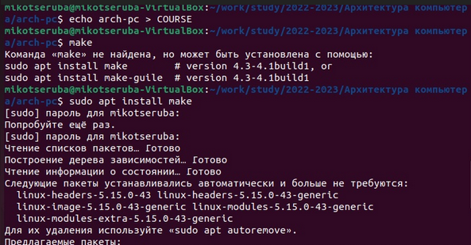
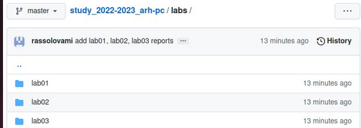

---
## Front matter
title: "Лабораторная работа №4"
subtitle: "Архитектура компьютера"
author: "Рассолова Маргарита Сергеевна"

## Generic otions
lang: ru-RU
toc-title: "Содержание"

## Bibliography
bibliography: bib/cite.bib
csl: pandoc/csl/gost-r-7-0-5-2008-numeric.csl

## Pdf output format
toc: true # Table of contents
toc-depth: 2
lof: true # List of figures
lot: true # List of tables
fontsize: 12pt
linestretch: 1.5
papersize: a4
documentclass: scrreprt
## I18n polyglossia
polyglossia-lang:
  name: russian
  options:
	- spelling=modern
	- babelshorthands=true
polyglossia-otherlangs:
  name: english
## I18n babel
babel-lang: russian
babel-otherlangs: english
## Fonts
mainfont: PT Serif
romanfont: PT Serif
sansfont: PT Sans
monofont: PT Mono
mainfontoptions: Ligatures=TeX
romanfontoptions: Ligatures=TeX
sansfontoptions: Ligatures=TeX,Scale=MatchLowercase
monofontoptions: Scale=MatchLowercase,Scale=0.9
## Biblatex
biblatex: true
biblio-style: "gost-numeric"
biblatexoptions:
  - parentracker=true
  - backend=biber
  - hyperref=auto
  - language=auto
  - autolang=other*
  - citestyle=gost-numeric
## Pandoc-crossref LaTeX customization
figureTitle: "Рис."
tableTitle: "Таблица"
listingTitle: "Листинг"
lofTitle: "Список иллюстраций"
lotTitle: "Список таблиц"
lolTitle: "Листинги"
## Misc options
indent: true
header-includes:
  - \usepackage{indentfirst}
  - \usepackage{float} # keep figures where there are in the text
  - \floatplacement{figure}{H} # keep figures where there are in the text
---

# Цель работы

Целью работы является освоение процедуры оформления отчетов с помощью легковесного языка разметки Markdown.

# Теоретическое введение

Markdown - язык текстовой разметки. Он позволяет создавать текстовые документы без использования других редакторов. Его можно прочитать в любом браузере.
Он позволяет добавлять к тексту базовое форматирование, используя изображения, символы. Тексты можно без труда сконвертировать в HTML. 
Большинство программиростов предпочитают Markdown для написания документаций, описания своих проектов и так далее.
Тексты Markdown можно прочитать с помощью любого текстового редактора.

# Выполнение лабораторной работы

1. Запустила терминал и в командах указала почту и имя аккаунта, где находится мой репозиторий. (рис. [-@fig:001])
{ #fig:001 width=70% }

2. Создала SSH ключ. (рис. [-@fig:002], рис. [-@fig:003], рис. [-@fig:004],рис. [-@fig:005], рис. [-@fig:006])

{ #fig:002 width=70% }
{ #fig:003 width=70% }
{ #fig:004 width=70% }
{ #fig:005 width=70% }
{ #fig:006 width=70% }

3. Создала каталог "Архитектура компьютера" и репозиторий. В терминале перешла в каталог курса, клонировала созданный репозиторий. Затем удалила лишние файлы. (рис. [-@fig:007], рис. [-@fig:008], рис. [-@fig:009])

{ #fig:007 width=70% }
{ #fig:008 width=70% }
{ #fig:009 width=70% }

4. Создала каталоги. (рис. [-@fig:010])

{ #fig:010 width=70% }

5. Отправила файлы на сервер. (рис. [-@fig:011])

{ #fig:011 width=70% }

6. Проверила гитхаб. (рис. [-@fig:012])

{ #fig:011 width=70% }

#Самостоятельная работа

1. В каталоге "Архитектура компьютера" создала файл третьей лабораторной работы. (рис. [-@fig:013])

{ #fig:013 width=70% }

2. Скопировала Лаб01 и Лаб02. Отправила на Гит. Проверила Гитхаб (рис. [-@fig:014], рис. [-@fig:015])

{ #fig:014 width=70% }
{ #fig:015 width=70% }

# Выводы

Научилась работать с системой Git. 

