---
## Front matter
title: "Лабораторная работа №5"
subtitle: "Создание и процесс обработки программ на языке ассемблера NASM"
author: "Дмитрий Сергеевич Кулябов"

## Generic otions
lang: ru-RU
toc-title: "Содержание"

## Bibliography
bibliography: bib/cite.bib
csl: pandoc/csl/gost-r-7-0-5-2008-numeric.csl

## Pdf output format
toc: true # Table of contents
toc-depth: 2
lof: true # List of figures
lot: true # List of tables
fontsize: 12pt
linestretch: 1.5
papersize: a4
documentclass: scrreprt
## I18n polyglossia
polyglossia-lang:
  name: russian
  options:
	- spelling=modern
	- babelshorthands=true
polyglossia-otherlangs:
  name: english
## I18n babel
babel-lang: russian
babel-otherlangs: english
## Fonts
mainfont: PT Serif
romanfont: PT Serif
sansfont: PT Sans
monofont: PT Mono
mainfontoptions: Ligatures=TeX
romanfontoptions: Ligatures=TeX
sansfontoptions: Ligatures=TeX,Scale=MatchLowercase
monofontoptions: Scale=MatchLowercase,Scale=0.9
## Biblatex
biblatex: true
biblio-style: "gost-numeric"
biblatexoptions:
  - parentracker=true
  - backend=biber
  - hyperref=auto
  - language=auto
  - autolang=other*
  - citestyle=gost-numeric
## Pandoc-crossref LaTeX customization
figureTitle: "Рис."
tableTitle: "Таблица"
listingTitle: "Листинг"
lofTitle: "Список иллюстраций"
lotTitle: "Список таблиц"
lolTitle: "Листинги"
## Misc options
indent: true
header-includes:
  - \usepackage{indentfirst}
  - \usepackage{float} # keep figures where there are in the text
  - \floatplacement{figure}{H} # keep figures where there are in the text
---

# Цель работы

Освоить процедуры компиляции и сборки программ, написанных на ассемблере NASM.

# Теоретическое введение
NASM (Netwide Assembler) — свободный (LGPL и лицензия BSD) ассемблер для архитектуры Intel x86. Используется для написания 16-, 32- и 64-разрядных программ. 
NASM может работать на платформах, отличных от x86, таких как SPARC и PowerPC, однако код он генерирует только для x86 и x86-64.
NASM успешно конкурирует со стандартным в Linux- и многих других UNIX-системах ассемблером gas. Считается, что качество документации у NASM выше, чем у gas. Кроме того, ассемблер gas по умолчанию использует AT&T-синтаксис, ориентированный на процессоры не от Intel, в то время как NASM использует вариант традиционного для x86-ассемблеров Intel-синтаксиса; Intel-синтаксис используется всеми ассемблерами для DOS/Windows, например, MASM, TASM, fasm. 

# Выполнение лабораторной работы

1. Создала каталог для работы с программами на языке ассемблера NASM с помощью команды mkdir. Перешла в него с помощью команды cd. (рис. [-@fig:001], рис. [-@fig:002])
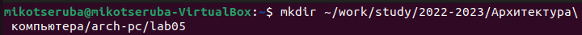{ #fig:001 width=70% }
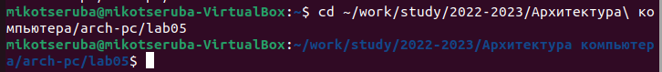{ #fig:002 width=70% }

2. Создала текстовый файл с именем hello.asm с помощью команды touch. (рис. [-@fig:003])
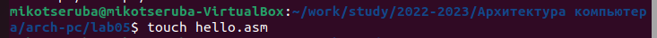{ #fig:003 width=70% }

3. Открыла файл с помощью текстового редактора gedit. Ввела туда текст из файла к лабораторной работе. (рис. [-@fig:004], рис. [-@fig:005])
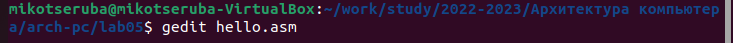{ #fig:004 width=70% }
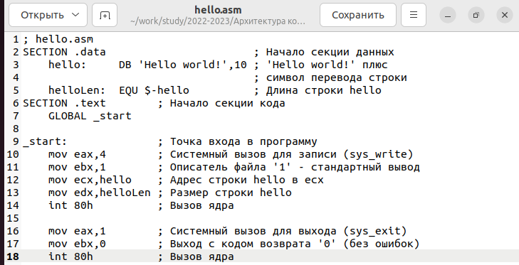{ #fig:005 width=70% }

4. Провела компиляцию текста программы с помощью команды nasm -f elf hello.asm. Проверила с помощью команды ls. (рис. [-@fig:006], рис. [-@fig:007])
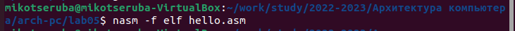{ #fig:006 width=70% }
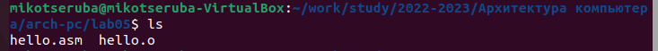{ #fig:007 width=70% }

5. Скомпилировала файл с помощью команды nasm -o obj.o -elf -g -l list.lst hello.asm. Проверила с помощью команды ls. (рис. [-@fig:008], рис. [-@fig:009])
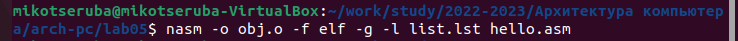{ #fig:008 width=70% }
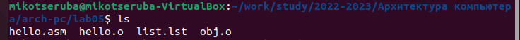{ #fig:009 width=70% }

6. Передала файл на обработку компоновщику с помощью команды ld -m elf_i386 hello.o -o hello. (рис. [-@fig:010])
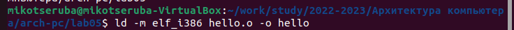{ #fig:010 width=70% }

7. Также выполнила команду ld -m elf_i386 obj.o -o main. (рис. [-@fig:011])
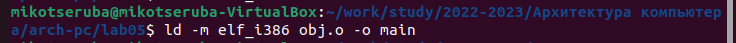{ #fig:011 width=70% }

8. Запустила на выполнение созданный исполняемый файл с помощью команды ./hello. (рис. [-@fig:012])
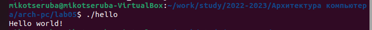{ #fig:012 width=70% }

# Самостоятельная работа

1. В каталоге ~/work/study/arch-pc/lab05 с помощью команды cp создала копию файла hello.asm с именем lab5.asm. Проверила с помощью команды ls. (рис. [-@fig:013])
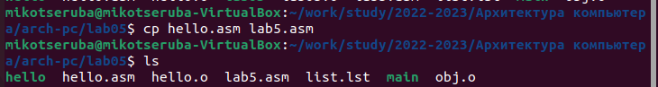{ #fig:013 width=70% }

2. С помощью текстового редактора gedit открыла файл, изменила "Hello world!" на свое имя и фамилию. (рис. [-@fig:014], рис. [-@fig:015])
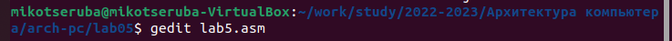{ #fig:014 width=70% }
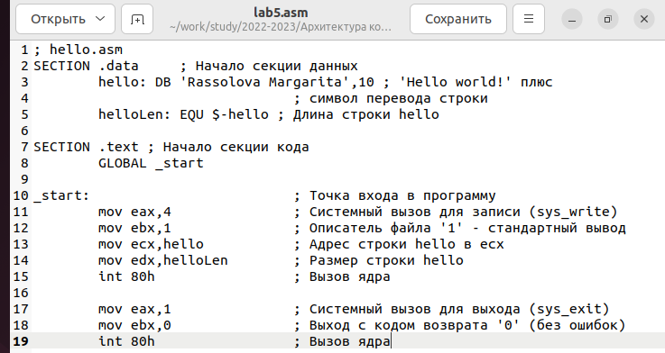{ #fig:015 width=70% }

3. Оттранслировала полученный текст программы, выполнила компоновку объектного файла с помощью команд,  описанных в 4-7 пунктах  выполнения лабораторной работы. (рис. [-@fig:016]) 
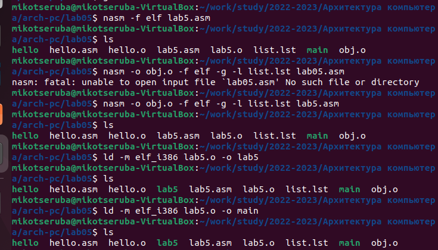{ #fig:016 width=70% }

4. Запустила получившийся файл с помощью команды ./lab5. (рис. [-@fig:017])
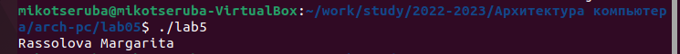{ #fig:017 width=70% }

# Выводы

Освоила процедуры компиляции и сборки программ, написанных на ассемблере NASM.
