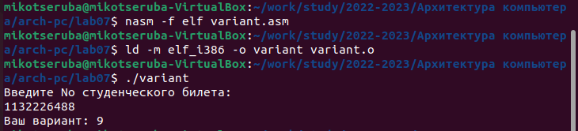

---
## Front matter
title: "Лабораторная работа №7"
subtitle: "Символьные и численные данные в NASM"
author: "Рассолова Маргарита Сергеевна"

## Generic otions
lang: ru-RU
toc-title: "Содержание"

## Bibliography
bibliography: bib/cite.bib
csl: pandoc/csl/gost-r-7-0-5-2008-numeric.csl

## Pdf output format
toc: true # Table of contents
toc-depth: 2
lof: true # List of figures
lot: true # List of tables
fontsize: 12pt
linestretch: 1.5
papersize: a4
documentclass: scrreprt
## I18n polyglossia
polyglossia-lang:
  name: russian
  options:
	- spelling=modern
	- babelshorthands=true
polyglossia-otherlangs:
  name: english
## I18n babel
babel-lang: russian
babel-otherlangs: english
## Fonts
mainfont: PT Serif
romanfont: PT Serif
sansfont: PT Sans
monofont: PT Mono
mainfontoptions: Ligatures=TeX
romanfontoptions: Ligatures=TeX
sansfontoptions: Ligatures=TeX,Scale=MatchLowercase
monofontoptions: Scale=MatchLowercase,Scale=0.9
## Biblatex
biblatex: true
biblio-style: "gost-numeric"
biblatexoptions:
  - parentracker=true
  - backend=biber
  - hyperref=auto
  - language=auto
  - autolang=other*
  - citestyle=gost-numeric
## Pandoc-crossref LaTeX customization
figureTitle: "Рис."
tableTitle: "Таблица"
listingTitle: "Листинг"
lofTitle: "Список иллюстраций"
lotTitle: "Список таблиц"
lolTitle: "Листинги"
## Misc options
indent: true
header-includes:
  - \usepackage{indentfirst}
  - \usepackage{float} # keep figures where there are in the text
  - \floatplacement{figure}{H} # keep figures where there are in the text
---

# Цель работы

Освоение арифметических инструкций языка ассемблера NASM.

# Теоретическое введение

Микропроцессор может выполнять целочисленные операции и операции с плавающей точкой. Для этого в его архитектуре есть два отдельных блока:

•устройство для выполнения целочисленных операций;

•устройство с плавающей точкой.

Каждое из этих устройств имеет свою систему команд. В принципе, целочисленное устройство может взять на себя многие функции устройства с плавающей точкой, но это потребует больших вычислительных затрат.

!!! Для большинства задач, использующих язык ассемблера, достаточно целочисленной арифметики. 

# Выполнение лабораторной работы

1. Создала каталог для Лабораторной работы №7 и файл lab7-1.(рис. [-@fig:001])

{ #fig:001 width=70% }

2. Ввела текст из лабораторной. (рис. [-@fig:002])

{ #fig:002 width=70% }

3. Создала исполняемый файл и запустила его. (рис. [-@fig:003])

{ #fig:003 width=70% }

4. Изменила текст программы так, как было сказано в инструкции к лабораторной работе. (рис. [-@fig:004])

{ #fig:004 width=70% }

5. Создала исполняемый файл и запустила его.  (рис. [-@fig:005])

{ #fig:005 width=70% }

6. Создала файл lab7-2. (рис. [-@fig:006])

{ #fig:006 width=70% } 

7. Ввела в него текст программы из инструкции к лабораторной работе. (рис. [-@fig:007])

{ #fig:007 width=70% }

8. Создала исполняемый файл и запустила его (рис. [-@fig:008])

{ #fig:008 width=70% }

9. Изменила текст программы, как сказано в инструкции, убрав кавычки. (рис. [-@fig:009])

{ #fig:009 width=70% }

10. Создала исполняемый файл и запустила его. Ответ на вопрос: 10. (рис. [-@fig:010])

{ #fig:010 width=70% }

11. Заменила iprintLF на iprint. Ответ на вопрос: при iprint выводятся числа в формате ASCII, iprintLF работает аналогично, но  при выводе на экран после числа добавляет к символ перевода строки. (рис. [-@fig:011])

{ #fig:011 width=70% }

12. Создала исполняемый файл и запустила его. (рис. [-@fig:012])

{ #fig:012 width=70% } 

13. Создала файл lab7-3 и ввела в него нужный текст. (рис. [-@fig:013])

{ #fig:013 width=70% }

14. Создала исполняемый файл и запустила его. (рис. [-@fig:014])

{ #fig:014 width=70% } 

15. Изменила текст программы для вычисления выражения = (4*6+2)\5. (рис. [-@fig:015])

{ #fig:015 width=70% } 

16. Создала исполняемый файл и запустила его. (рис. [-@fig:016])

{ #fig:016 width=70% } 

17. Создала файл variant.asm. (рис. [-@fig:017])

{ #fig:017 width=70% }

18. Ввела нужный текст. (рис. [-@fig:018])

{ #fig:018 width=70% }

19. Создала исполняемый файл и запустила его. (рис. [-@fig:019])

{ #fig:019 width=70% }

# Ответы на вопросы. 

1. За это отвечают строки mov eax, rem call sprint.
2. "mov ecx,x" - записывает адрес выводимого сообщения в eax; "mov edx,80" - записывает длину вводимого сообщения в ebx; "call sread" -  выполняет вызов программы ввода сообщения.
3. "Call atoi" используется для преобразования символа в число.
4. xor edx, edx mov ebx, 20 div ebx inc edx.
5. В регистр ebx.
6. Увеличение значения edx на единицу.
7. mov eax, edx call iprintLF.

# Самостоятельная работа. 

Мне попался Вариант - 9, поэтому я буду работать с ним.

1. Создала файл самостоятельной работы. (рис. [-@fig:020])

{ #fig:020 width=70% }

2. Написала текст программы. (рис. [-@fig:021], рис. [-@fig:022])

{ #fig:021 width=70% }
{ #fig:022 width=70% }

3. Создала исполняемый файл и запустила его.(рис. [-@fig:023])

{ #fig:023 width=70% }

# Выводы

Освоила арифметические инструкции языка ассемблера NASM.

# Список литературы{.unnumbered}

::: {#refs}
:::
