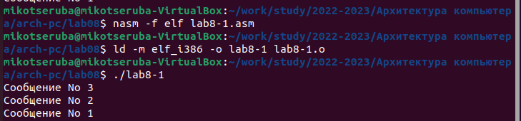

---
## Front matter
title: "Лабораторная работа №8"
subtitle: "Команды безусловного и условного переходов в Nasm. Программирование ветвлений."
author: "Рассолова Маргарита"

## Generic otions
lang: ru-RU
toc-title: "Содержание"

## Bibliography
bibliography: bib/cite.bib
csl: pandoc/csl/gost-r-7-0-5-2008-numeric.csl

## Pdf output format
toc: true # Table of contents
toc-depth: 2
lof: true # List of figures
lot: true # List of tables
fontsize: 12pt
linestretch: 1.5
papersize: a4
documentclass: scrreprt
## I18n polyglossia
polyglossia-lang:
  name: russian
  options:
	- spelling=modern
	- babelshorthands=true
polyglossia-otherlangs:
  name: english
## I18n babel
babel-lang: russian
babel-otherlangs: english
## Fonts
mainfont: PT Serif
romanfont: PT Serif
sansfont: PT Sans
monofont: PT Mono
mainfontoptions: Ligatures=TeX
romanfontoptions: Ligatures=TeX
sansfontoptions: Ligatures=TeX,Scale=MatchLowercase
monofontoptions: Scale=MatchLowercase,Scale=0.9
## Biblatex
biblatex: true
biblio-style: "gost-numeric"
biblatexoptions:
  - parentracker=true
  - backend=biber
  - hyperref=auto
  - language=auto
  - autolang=other*
  - citestyle=gost-numeric
## Pandoc-crossref LaTeX customization
figureTitle: "Рис."
tableTitle: "Таблица"
listingTitle: "Листинг"
lofTitle: "Список иллюстраций"
lotTitle: "Список таблиц"
lolTitle: "Листинги"
## Misc options
indent: true
header-includes:
  - \usepackage{indentfirst}
  - \usepackage{float} # keep figures where there are in the text
  - \floatplacement{figure}{H} # keep figures where there are in the text
---

# Цель работы

Изучение команд условного и безусловного переходов. Приобретение навыков написания программ с использованием переходов. Знакомство с назначением и структурой файла листинга.

# Теоретическое введение

Безусловный переход — это переход, который выполняется всегда. Безусловный переход осуществляется с помощью команды JMP. У этой команды один операнд, который может быть непосредственным адресом, регистром или ячейкой памяти, содержащей адрес.
Условный переход осуществляется, если выполняется определённое условие, заданное флагами процессора. Cостояние флагов изменяется после выполнения арифметических, логических и некоторых других команд. Если условие не выполняется, то управление переходит к следующей команде. 

# Выполнение лабораторной работы

1. Создала каталог для восьмой лабораторной работы и файл к ней.  (рис. [-@fig:001])

{ #fig:001 width=70% }

2. Ввела в созданный файл текст программы из листинга 8-1. (рис. [-@fig:002])

{ #fig:002 width=70% }

3. Создала объектный файл и запустила его. (рис. [-@fig:003])

{ #fig:003 width=70% }

4. Изменила текст программы в соответствии с листингом 8-2. (рис. [-@fig:004])

{ #fig:004 width=70% }

5. Создала объектный файл и запустила его. (рис. [-@fig:005])

{ #fig:005 width=70% } 

6. Изменила текст программы снова. (рис. [-@fig:006])

{ #fig:006 width=70% }

7. Создала объектный файл и запустила его. (рис. [-@fig:007])

{ #fig:007 width=70% } 

8. Создала файл lab8-2. (рис. [-@fig:008])

{ #fig:008 width=70% } 

9. Вставила в новый файл текст программы из листинга 8-3. (рис. [-@fig:009])

{ #fig:009 width=70% } 

10. Создала объектный файл и проверила его работу. (рис. [-@fig:010])

{ #fig:010 width=70% }

11. Создала файл листинга для программы из файла lab8-2.asm. Открыла его с помощью текстового редактора mcedit. (рис. [-@fig:011])

{ #fig:011 width=70% }

12. 27 строка. Адрес 00000012. Машинный код 50. push eax (исходный текст программы) - выделяет место наверху стека и помещает туда значение из регистра eax. (рис. [-@fig:012])

{ #fig:012 width=70% }

13. 55 строка. Адрес 00000040. Машинный код 58. pop eax (исходный текст программы) - переносит любые данные из верхней части стека в eax и освобождает эту область памяти. (рис. [-@fig:013])

{ #fig:013 width=70% }

14. 95 строка. Адрес 00000073. Машинный код 49. dec ecx (исходный текст программы) - уменьшает значение ecx на единицу. (рис. [-@fig:014])

{ #fig:014 width=70% }

15. В 34 строке удалила max. (рис. [-@fig:015])

{ #fig:015 width=70% }

16. При попытке создать файл листинга выдалась ошибка. (рис. [-@fig:016])

{ #fig:016 width=70% }

# Самостоятельная работа (Вариант 9)

17. Создала файл для первого задания. (рис. [-@fig:017])

{ #fig:017 width=70% }

18. Написала к нему программу. (рис. [-@fig:018])

{ #fig:018 width=70% }

19. Создала объектный файл и запустила программу. (рис. [-@fig:019])

{ #fig:019 width=70% }

20. Создала файл для второго задания. (рис. [-@fig:020])

{ #fig:020 width=70% }

21. Написала программу. (рис. [-@fig:021])

{ #fig:021 width=70% }

22. Создала объектный файл и запустила программу. (рис. [-@fig:022])

{ #fig:022 width=70% }

# Выводы

Изучила команды условного и безусловного переходов. Приобрела навык написания программ с использованием переходов. Познакомилась  с назначением и структурой файла листинга.

# Список литературы{.unnumbered}

::: {#refs}
:::
