---
## Front matter
title: "Лабораторная работа №9"
subtitle: "Программирование цикла. Обработка аргументов командной строки."
author: "Рассолова Маргарита Сергеевна"

## Generic otions
lang: ru-RU
toc-title: "Содержание"

## Bibliography
bibliography: bib/cite.bib
csl: pandoc/csl/gost-r-7-0-5-2008-numeric.csl

## Pdf output format
toc: true # Table of contents
toc-depth: 2
lof: true # List of figures
lot: true # List of tables
fontsize: 12pt
linestretch: 1.5
papersize: a4
documentclass: scrreprt
## I18n polyglossia
polyglossia-lang:
  name: russian
  options:
	- spelling=modern
	- babelshorthands=true
polyglossia-otherlangs:
  name: english
## I18n babel
babel-lang: russian
babel-otherlangs: english
## Fonts
mainfont: PT Serif
romanfont: PT Serif
sansfont: PT Sans
monofont: PT Mono
mainfontoptions: Ligatures=TeX
romanfontoptions: Ligatures=TeX
sansfontoptions: Ligatures=TeX,Scale=MatchLowercase
monofontoptions: Scale=MatchLowercase,Scale=0.9
## Biblatex
biblatex: true
biblio-style: "gost-numeric"
biblatexoptions:
  - parentracker=true
  - backend=biber
  - hyperref=auto
  - language=auto
  - autolang=other*
  - citestyle=gost-numeric
## Pandoc-crossref LaTeX customization
figureTitle: "Рис."
tableTitle: "Таблица"
listingTitle: "Листинг"
lofTitle: "Список иллюстраций"
lotTitle: "Список таблиц"
lolTitle: "Листинги"
## Misc options
indent: true
header-includes:
  - \usepackage{indentfirst}
  - \usepackage{float} # keep figures where there are in the text
  - \floatplacement{figure}{H} # keep figures where there are in the text
---

# Цель работы

Приобретение навыков написания программ с использованием циклов и
обработкой аргументов командной строки.

# Теоретическое введение

Циклы в программировании используются при необходимости повторять действие, пока определенное условие остается истинным. 

Аргумент командной строки — это информация, которая вводится в командной строке операционной системы вслед за именем программы.

# Выполнение лабораторной работы

1. Создала каталог для девятой лабораторной и первый файл для работы с ней. (рис. [-@fig:001])

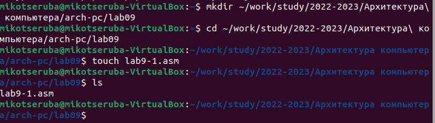{ #fig:001 width=70% }

2. Ввела в файл текст программы из первого листинга. (рис. [-@fig:002])

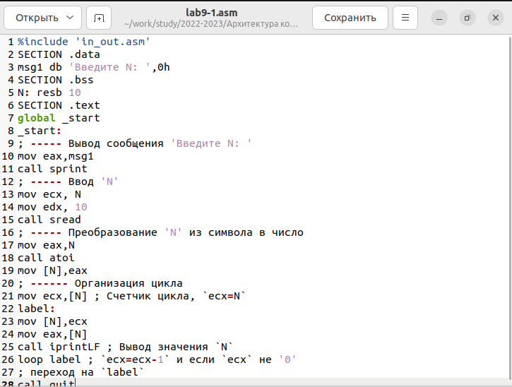{ #fig:002 width=70% }

3. Создала исполняемый файл и проверила его работу. Вводила число "4". (рис. [-@fig:003])

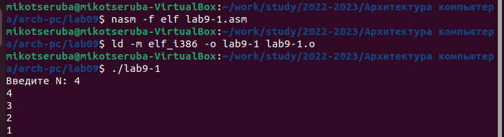{ #fig:003 width=70% }

4. Изменила текст программы в соответствии с инструкцией. (рис. [-@fig:004])

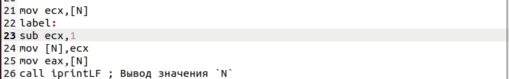{ #fig:004 width=70% }

5. Создала исполняемый файл и проверила его работу. Вводила число "5". Получилась "закольцовка" цикла. Он стал бесконечным. (рис. [-@fig:005])

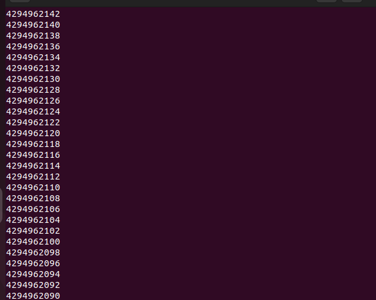{ #fig:005 width=70% }

6. Исправила текст программы. (рис. [-@fig:006])

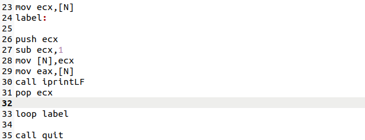{ #fig:006 width=70% }

7. Создала исполняемый файл и проверила его работу. Счетчик стал работать верно. Теперь число проходов цикла соответствует значению N, введенного с клавиатуры. (рис. [-@fig:007])

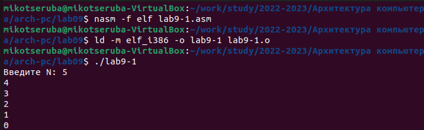{ #fig:007 width=70% }

8. Создала второй файл. (рис. [-@fig:008])

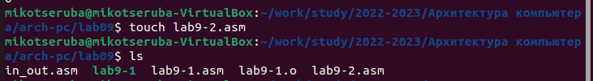{ #fig:008 width=70% }

9. Ввела в созданный файл текст программы из второго листинга. (рис. [-@fig:009])

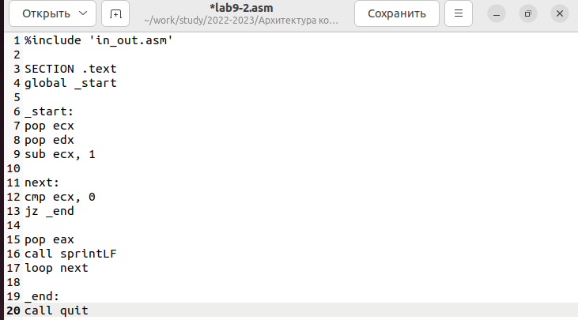{ #fig:009 width=70% } 

10. Создала исполняемый файл и проверила его работу. Программа вывела все три введенных аргумента, но в разном порядке.  (рис. [-@fig:010])

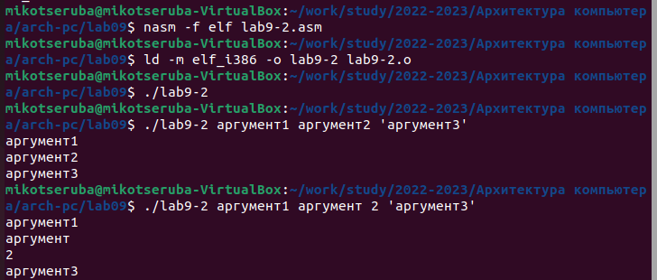{ #fig:010 width=70% }

11. Создала девятый файл. (рис. [-@fig:011])

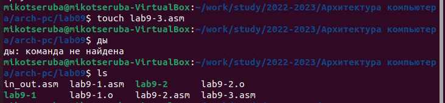{ #fig:011 width=70% }

12. Ввела в созданный файл текст программы из третьего листинга. (рис. [-@fig:012])

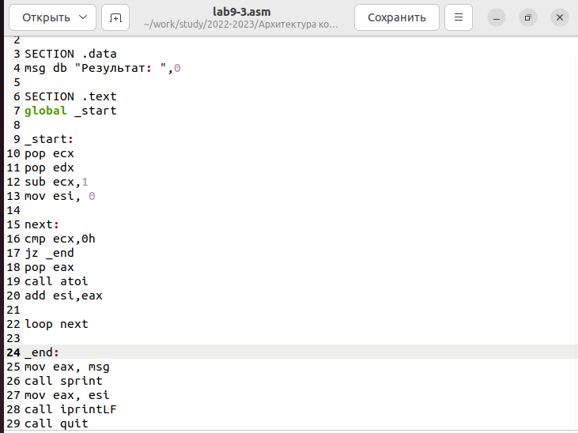{ #fig:012 width=70% } 

13. Создала исполняемый файл и проверила его работу. (рис. [-@fig:013])

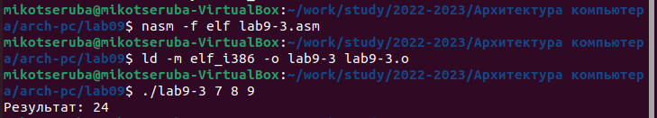{ #fig:013 width=70% }

14. Изменила текст программы для вычисления произведения аргументов командной строки. (рис. [-@fig:014])

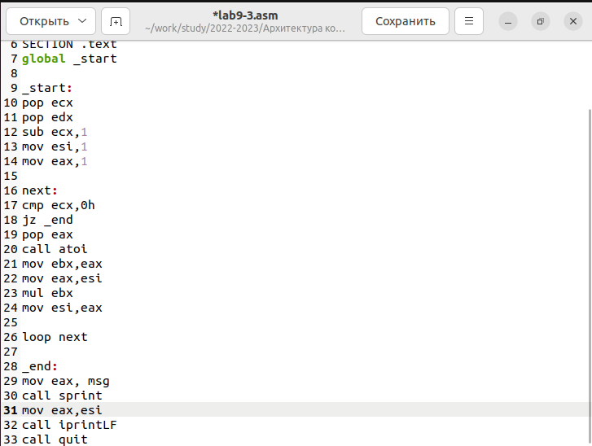{ #fig:014 width=70% }

15. Создала исполняемый файл и проверила его работу. (рис. [-@fig:015])

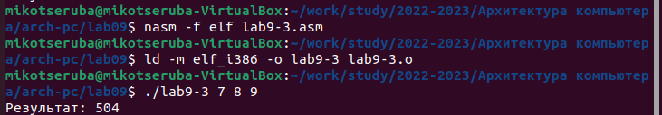{ #fig:015 width=70% }

#Выполнение самостоятельной работы

16. Создала файл для самостоятельной работы. (рис. [-@fig:016])

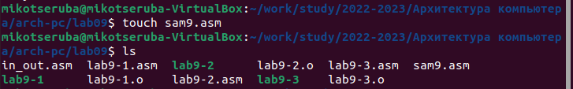{ #fig:016 width=70% }

17. У меня 9 вариант. Написала для него программу. (рис. [-@fig:017], рис. [-@fig:018])

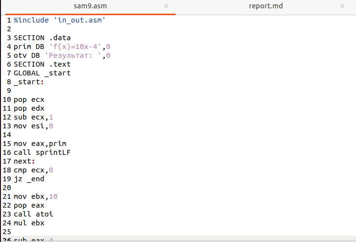{ #fig:017 width=70% }
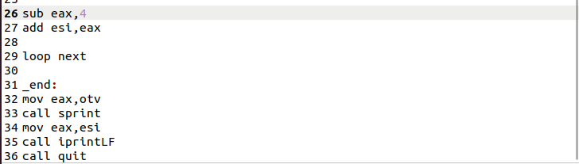{ #fig:018 width=70% }

18. Создала исполняемый файл и проверила его работу. (рис. [-@fig:019])

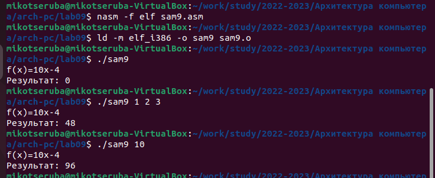{ #fig:019 width=70% }

# Выводы

Приобрела навыки написания программ с использованием циклов и
обработкой аргументов командной строки.

# Список литературы{.unnumbered}

::: {#refs}
:::
