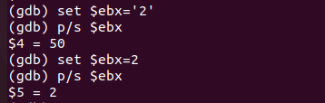
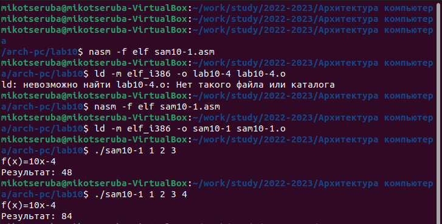
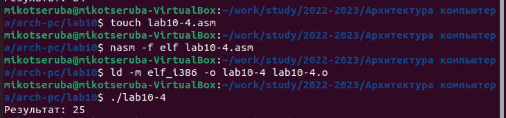

---
## Front matter
title: "Лабораторная работа No10."
subtitle: "Понятие подпрограммы. Отладчик GDB."
author: "Рассолова Маргарита Сергеевна"

## Generic otions
lang: ru-RU
toc-title: "Содержание"

## Bibliography
bibliography: bib/cite.bib
csl: pandoc/csl/gost-r-7-0-5-2008-numeric.csl

## Pdf output format
toc: true # Table of contents
toc-depth: 2
lof: true # List of figures
lot: true # List of tables
fontsize: 12pt
linestretch: 1.5
papersize: a4
documentclass: scrreprt
## I18n polyglossia
polyglossia-lang:
  name: russian
  options:
	- spelling=modern
	- babelshorthands=true
polyglossia-otherlangs:
  name: english
## I18n babel
babel-lang: russian
babel-otherlangs: english
## Fonts
mainfont: PT Serif
romanfont: PT Serif
sansfont: PT Sans
monofont: PT Mono
mainfontoptions: Ligatures=TeX
romanfontoptions: Ligatures=TeX
sansfontoptions: Ligatures=TeX,Scale=MatchLowercase
monofontoptions: Scale=MatchLowercase,Scale=0.9
## Biblatex
biblatex: true
biblio-style: "gost-numeric"
biblatexoptions:
  - parentracker=true
  - backend=biber
  - hyperref=auto
  - language=auto
  - autolang=other*
  - citestyle=gost-numeric
## Pandoc-crossref LaTeX customization
figureTitle: "Рис."
tableTitle: "Таблица"
listingTitle: "Листинг"
lofTitle: "Список иллюстраций"
lotTitle: "Список таблиц"
lolTitle: "Листинги"
## Misc options
indent: true
header-includes:
  - \usepackage{indentfirst}
  - \usepackage{float} # keep figures where there are in the text
  - \floatplacement{figure}{H} # keep figures where there are in the text
---

# Цель работы

Приобретение навыков написания программ с использованием подпрограмм.
Знакомство с методами отладки при помощи GDB и его основными возможностями.

# Теоретическое введение

Подпрограмма - это программа, которую можно выполнять в разных местах в составе одной или нескольких программ.
Отладчик — это узкоспециализированное средство разработки, которое присоединяется к работающему приложению и позволяет проверять код.

# Выполнение лабораторной работы

1. Создала каталог для 10 лабораторной и файл к ней. (рис. [-@fig:001])

{ #fig:001 width=70% }

2. Ввела в созданный файл текст программы из Листинга 1. (рис. [-@fig:002])

{ #fig:002 width=70% }

3. Создала исполняемый файл и проверила его работу. (рис. [-@fig:003])

{ #fig:003 width=70% }

4. Изменила текст программы в соответствии с инструкцией. (рис. [-@fig:004], рис. [-@fig:005])

{ #fig:004 width=70% }
{ #fig:005 width=70% }

5. Создала исполняемый файл и проверила его работу. (рис. [-@fig:006])

{ #fig:006 width=70% }

6. Создала файл 2. (рис. [-@fig:007])

{ #fig:007 width=70% }

7. Ввела в созданный файл текст программы из Листинга 2. (рис. [-@fig:008])

{ #fig:008 width=70% }

8. Получила исполняемый файл и загрузила его в отладчик gdb. (рис. [-@fig:009])

{ #fig:009 width=70% }

9. Проверила работу программы. (рис. [-@fig:010])

{ #fig:010 width=70% }

10. Установила брейкпоинт на метку _start. Запустила ее. (рис. [-@fig:011])

{ #fig:011 width=70% }

11. Посмотрела дисассимилированный код программы. (рис. [-@fig:012])

{ #fig:012 width=70% }

12. Подключилась на отображение команд с Intel'овским синтаксисом. Различия: В коде Интел отсутствуют суффиксы обозначения размера, код Интел опускает символ "%" перед именами регистров, имеет другой способ описания местоположений в памяти.  (рис. [-@fig:013])

{ #fig:013 width=70% }

13. Включила режим псевдографики. (рис. [-@fig:014])

{ #fig:014 width=70% }

14. Проверила установку точки останова. (рис. [-@fig:015])

{ #fig:015 width=70% }

15. Установила точку остановы по адресу инструкции. (рис. [-@fig:016])

{ #fig:016 width=70% }

16. Посмотрела информацию о всех установленных точках останова. (рис. [-@fig:017])

{ #fig:017 width=70% }

17. Посмотрела содержимое регистров. (рис. [-@fig:018], рис. [-@fig:019])

{ #fig:018 width=70% }
{ #fig:019 width=70% }

18. Посмотрела значения переменных.(рис. [-@fig:020], рис. [-@fig:021])

{ #fig:020 width=70% }
{ #fig:021 width=70% } 

19. Изменила первый символ переменной msg1. (рис. [-@fig:022])

{ #fig:022 width=70% }

20. Заменила символ в msg2. (рис. [-@fig:023])

{ #fig:023 width=70% }

21. Вывела в шестнадцатиричном, двоичном форматах и символьном виде значение регистра edx. (рис. [-@fig:024])

{ #fig:024 width=70% }

22. Изменила значение регистра ebx. (рис. [-@fig:025])

{ #fig:025 width=70% }

23. Скопировала файл 9 лабораторной в третий файл десятой лабораторной. (рис. [-@fig:026])

{ #fig:026 width=70% }

24. Создала исполняемый файл и загрузила его в отладчик, указав аргументы. (рис. [-@fig:027])

{ #fig:027 width=70% }

25. Посмотрела адрес вершины стека. (рис. [-@fig:028])

{ #fig:028 width=70% }

25. Установила точку останова и запустила ее. (рис. [-@fig:029])

{ #fig:029 width=70% }

# Самостоятельная работа

26. Преобразовала программу из девятой лабораторной. (рис. [-@fig:030])

{ #fig:030 width=70% }

27. Создала исполняемый файл и проверила его работу. (рис. [-@fig:031])

{ #fig:031 width=70% }

28. С помощью отладчика определила и исправила ошибку в листинге 3. (рис. [-@fig:032])

{ #fig:032 width=70% }

29. Создала исполняемый файл и проверила его работу. (рис. [-@fig:033])

{ #fig:033 width=70% }

# Выводы

Приобрела навыки написания программ с использованием подпрограмм.
Ознакомилась с методами отладки при помощи GDB и его основными возможностями.

# Список литературы{.unnumbered}

::: {#refs}
:::
