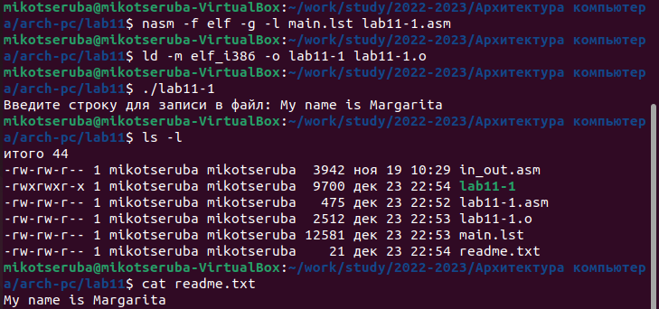
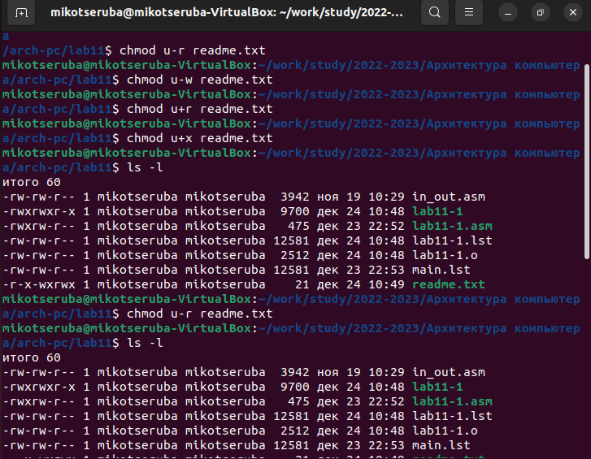
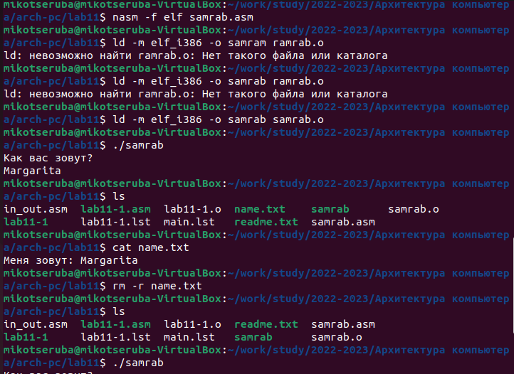

---
## Front matter
title: "Лабораторная работа No11"
subtitle: "Работа с файлами средствами Nasm"
author: "Рассолова Маргарита Сергеевна"

## Generic otions
lang: ru-RU
toc-title: "Содержание"

## Bibliography
bibliography: bib/cite.bib
csl: pandoc/csl/gost-r-7-0-5-2008-numeric.csl

## Pdf output format
toc: true # Table of contents
toc-depth: 2
lof: true # List of figures
lot: true # List of tables
fontsize: 12pt
linestretch: 1.5
papersize: a4
documentclass: scrreprt
## I18n polyglossia
polyglossia-lang:
  name: russian
  options:
	- spelling=modern
	- babelshorthands=true
polyglossia-otherlangs:
  name: english
## I18n babel
babel-lang: russian
babel-otherlangs: english
## Fonts
mainfont: PT Serif
romanfont: PT Serif
sansfont: PT Sans
monofont: PT Mono
mainfontoptions: Ligatures=TeX
romanfontoptions: Ligatures=TeX
sansfontoptions: Ligatures=TeX,Scale=MatchLowercase
monofontoptions: Scale=MatchLowercase,Scale=0.9
## Biblatex
biblatex: true
biblio-style: "gost-numeric"
biblatexoptions:
  - parentracker=true
  - backend=biber
  - hyperref=auto
  - language=auto
  - autolang=other*
  - citestyle=gost-numeric
## Pandoc-crossref LaTeX customization
figureTitle: "Рис."
tableTitle: "Таблица"
listingTitle: "Листинг"
lofTitle: "Список иллюстраций"
lotTitle: "Список таблиц"
lolTitle: "Листинги"
## Misc options
indent: true
header-includes:
  - \usepackage{indentfirst}
  - \usepackage{float} # keep figures where there are in the text
  - \floatplacement{figure}{H} # keep figures where there are in the text
---

# Цель работы

Приобретение навыков написания программ для работы с файлами.

# Теоретическое введение

Права доступа сформулированы относительно трёх действий: чтение, запись и исполнение. Эти права доступа могут быть предоставлены трём классам пользователей: владельцу файла (пользователю), группе-владельцу файла, и всем пользователям, которые не входят в эту группу.

# Выполнение лабораторной работы

1. Создала каталог для выполнения 11 лабораторной работы и файлы к ней. (рис. [-@fig:001])

{ #fig:001 width=70% }

2. Ввела в файл lab11-1.asm текст программы из листинга 11.1. (рис. [-@fig:002])

{ #fig:002 width=70% }

3. Создала исполняемый файл и проверила его работу. (рис. [-@fig:003])

{ #fig:003 width=70% }

4. С помощью команды chmod изменила права доступа к исполняемому файлу lab11-1, запретив его выполнение. Попыталась выполнить файл. Мне было отказано в доступе, потому что я запретила запуск программы владельцу. (рис. [-@fig:004])

{ #fig:004 width=70% }

5. С помощью команды chmod изменила права доступа к файлу lab11-1, добавив права на исполнение. Попыталась выполнить файл. Программа заработала, так как у файла были все разрешения, а в пункте 4 я запретила выполнение уже готовой программы. В этом пункте - новая программа, обладающая другими разрешениями. Этим я обосновала его работу. (рис. [-@fig:005])

{ #fig:005 width=70% }

6. Выполнение 9 варианта. (рис. [-@fig:006], рис. [-@fig:007])

{ #fig:006 width=70% }
{ #fig:007 width=70% }

# Самостоятельная работа

7. Создала файл для самостоятельной работы. (рис. [-@fig:008])

{ #fig:008 width=70% }

8. Написала программу (рис. [-@fig:009], рис. [-@fig:010])

{ #fig:009 width=70% }
{ #fig:010 width=70% }

9. Проверила работу программы (рис. [-@fig:010], рис. [-@fig:011])

{ #fig:010 width=70% }
{ #fig:011 width=70% }

# Выводы

Приобрела навыки написания программ для работы с файлами.

# Список литературы{.unnumbered}

::: {#refs}
:::
